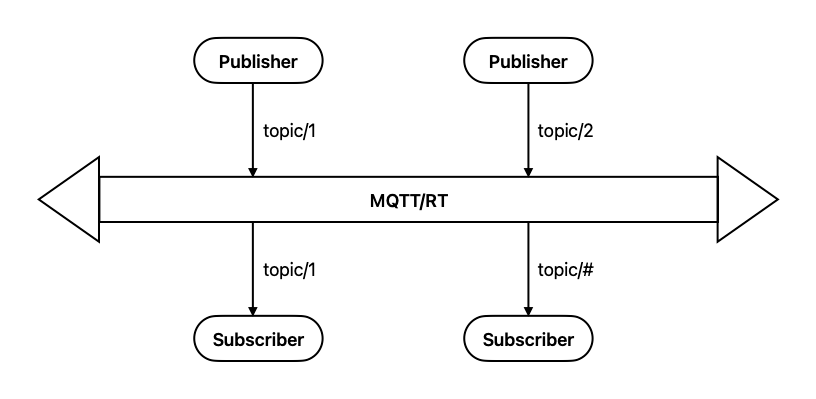
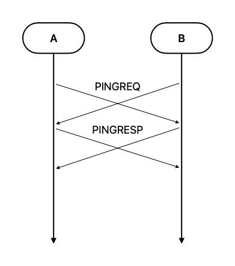
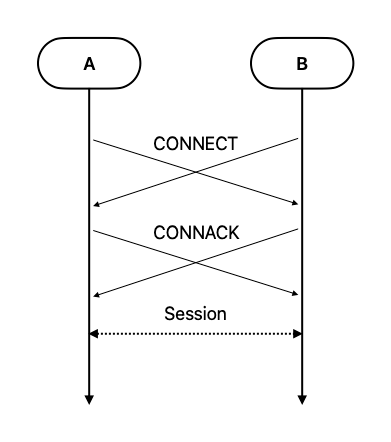
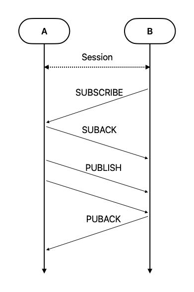
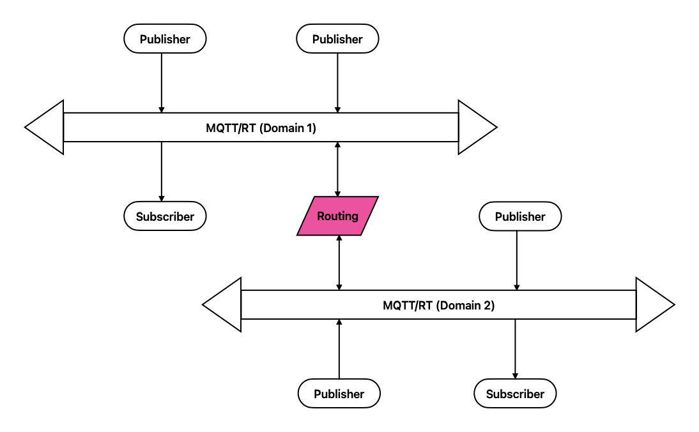
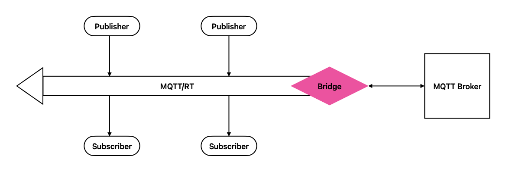

# MQTT-RT

## Overview

MQTT/RT is a real-time messaging bus for robotics, industrial automation, and autonomous driving. It's simple, modern, fast, and easy to implement.

## Architecture

MQTT/RT utilizes a distributed, peer-to-peer architecture, eliminating the need for a central broker in its most basic form. In this model, the network itself acts as a broker, with messages often broadcast or multicast over UDP. Each peer in the network can function as both a publisher and a subscriber. For scenarios requiring routing across physically isolated networks or bridging to traditional MQTT brokers, dedicated routing and bridging services can be implemented. Some advanced implementations of real-time MQTT, like RT-MQTT, leverage Software Defined Networking (SDN) to manage network resources and ensure real-time communication guarantees.

## Key Features

- **Broker-less, peer-to-peer**: Operates without a central broker, enabling direct communication between peers.
- **Real-time publish/subscribe**: Facilitates low-latency, event-driven communication for time-critical applications.
- **Multiple transports**: Supports various transport protocols including:
  - UDPv4, UDPv6
  - TCPv4, TCPv6
  - TLS, QUIC
  - Shared memory
  - Wireless standards like 802.11/802.15 (MAC/PHY)
- **Security**: Offers:
  - Authentication via PKI
  - Access control/permissions
  - Cryptography with data encryption (e.g., AES)
  - Audit logging
- **Auto-Discovery**: Peers can automatically discover each other within the same domain using:
  - Broadcast (255.255.255.1)
  - IP multicast (224.18.83.0:7000)
  - Static peer lists
- **Multi-Path across MAC/PHY**: Supports communication over multiple network interfaces at the MAC and physical layers.
- **Routing and bridging**: Includes a routing service to route messages among physically isolated domains and a bridging service to connect and bridge an MQTT/RT bus to a traditional MQTT broker.
- **Multi-Platform support**: Designed to run on various platforms including X86, ARM, and RISC-V.
- **Multi-language support**: Provides libraries and support for multiple programming languages such as C/C++, Python, and Rust.

See: [MQTT-UDP GitHub Repository](https://github.com/dzavalishin/mqtt_udp)

## Use Cases

- Robotics
- Autonomous
- Railways
- Aerospace
- Home Automation
- Industrial Automation
- IoT Gateway
- Military Defense
- Aviation

## Concepts

- **Domain**: Represents a physically isolated MQTT/RT messaging bus.
- **Namespace**: Represents a logically isolated MQTT/RT messaging bus.
- **Topic**: A hierarchical UTF-8 string used by the MQTT/RT (or network in brokerless mode) to filter messages for subscribers.
- **Publisher**: A client that sends (publishes) messages to a specific topic.
- **Subscriber**: A client that registers its interest (subscribes) in one or more topics to receive matching messages.
- **Message**: The unit of data transmission in MQTT/RT, consisting of a key, QoS level, metadata, and payload.
- **QoS (Quality of Service)**:
  Defines the level of reliability for message delivery:
  - **0 - At most once**: Messages are sent without any delivery confirmation and may be lost.
  - **1 - At least once**: Messages are guaranteed to be delivered at least once, but may be duplicated.
  - **2 - Exactly once**: Messages are guaranteed to be delivered exactly once to the subscriber.

## Discovery

For brokerless operation, MQTT/RT peers discover each other using the following mechanisms:

1. **Broadcast**: Sending PINGREQ packets to the broadcast address (255.255.255.1)
2. **IP multicast**: Sending PINGREQ packets to a specific multicast group (224.18.83.0:7000)
3. **Static peer list**: Configuring a predefined list of known MQTT/RT peer IP addresses

Upon receiving a PINGREQ, active MQTT/RT peers respond with a PINGRESP packet, allowing the requesting peer to build a map of active hosts on the network.

See: [MQTT-UDP Documentation](https://mqtt-udp.readthedocs.io/)

For no central MQTT broker to connect to, MQTT/RT peers must utilize discovery mechanisms to find each other in the same domain, such as:
- Broadcast: 255.255.255.1
- IP multicast: 224.18.83.0:7000
- Static peer list

MQTT/RT peers ping each other using PINGREQ/PINGRESP packets in the discovery phase.

Shall imitate ARP mechanism to avoid signaling storm.

Establish a MAC/IP-client-Topic pair in this stage.

## Session

MQTT/RT uses CONNECT/CONNACK packets to establish a session between peers found during the discovery phase. The process is as follows:

1. A peer initiates a session by sending a CONNECT packet to another peer.
2. The receiving peer acknowledges the connection request by sending a CONNACK packet back to the initiator.
3. Once the CONNACK is received, a communication session is established between the two peers.

The session handshake process is as following diagram:

## Publish/Subscribe

Once a session is established, peers can communicate using the MQTT publish/subscribe messages:

1. A publisher sends a PUBLISH packet containing the topic and payload to other peers in the network.
2. Peers that have subscribed to the published topic receive the message.
3. The delivery reliability is determined by the QoS level specified in the PUBLISH packet.

The publish/subscribe process is illustrated in the following diagram:

## Request/Reply

MQTT/RT supports a request-reply pattern to facilitate interactions where a response is expected for a request. This can be implemented in several ways:

### Topic-based Request/Reply
- A client sends a request by publishing to a specific topic
- The receiving peer processes the request and publishes the response to a designated reply topic
- The requesting client subscribes to this reply topic to receive the response
- The reply topic can be specific to the client or include a unique identifier to correlate requests and responses

### MQTT 5.0 Request/Response Properties
- Leveraging MQTT 5.0 features, a publisher can include a 'Response Topic' and 'Correlation Data' in the PUBLISH packet
- The responder then publishes the reply to the specified 'Response Topic', including the original 'Correlation Data' to allow the requester to match the response to the initial request

### SUBSCRIBE for Request
- In a brokerless UDP environment, a peer can send a request by sending a SUBSCRIBE message to a specific topic
- A peer responsible for that topic can then respond with a PUBLISH message containing the requested data
- This method is suitable for scenarios like remote configuration where devices request configuration parameters

TODO: add a diagram

## Message

MQTT/RT messages consist of the following components:

- **key**: A unique identifier for the message
- **metadata**: Additional information about the message, including:
  - durability: Indicates if the message should be persisted
  - history: Specifies if a history of messages should be maintained
  - resource limits: Defines any resource constraints associated with the message
  - deadline: Sets a time limit for the message to be delivered
- **payload**: The actual data being transmitted

## QoS

MQTT/RT supports three QoS levels for delivery reliability:

- **0 - At most once**: The message is sent once without any acknowledgement
- **1 - At least once**: The message is sent and re-tried until an acknowledgement (PUBACK) is received
- **2 - Exactly once**: The message is delivered exactly once using a four-way handshake (PUBLISH, PUBREC, PUBREL, PUBCOMP)

## Flow Control

MQTT/RT supports configurable throughput control, allowing limitation of data transmission volume under specific conditions. This helps prevent network congestion and ensures fair resource sharing among peers.

## Transports

MQTT/RT is designed to be flexible and support various transport protocols for different use cases and network environments:

- UDPv4, UDPv6
- TCPv4, TCPv6
- TLS for secure communication over TCP
- QUIC for low-latency and improved performance over UDP
- Shared memory for efficient inter-process communication on the same device
- Wireless standards: 802.11 (Wi-Fi) and 802.15 (Bluetooth, Zigbee) at the MAC and PHY layers

## Security

Security is a critical aspect of MQTT/RT, and the following features are supported:

- **Authentication**: PKI (Public Key Infrastructure) for secure peer authentication
- **Access Control/Access Permissions**: Mechanisms to control which peers can publish to or subscribe to specific topics
- **Cryptography, Data Encryption**: Support for cryptographic algorithms like AES for encrypting message payloads to ensure data confidentiality
- **Audit Logging**: Logging of security-related events for monitoring and auditing purposes

## Persistence

MQTT/RT can optionally use SQLite3 for persistent storage of messages, session information, and other relevant data. This ensures data durability across restarts and network interruptions.

## Data Model

MQTT/RT supports various data serialization formats for the message payload, including:

- Protocol Buffers
- FlatBuffers
- JSON
- Apache Avro

The choice of data model depends on factors like performance, size efficiency, and language support.

## Threading Model

MQTT/RT can be implemented using either threads or an actor-based concurrency model to handle concurrent operations and I/O efficiently. The choice depends on the specific implementation requirements and platform capabilities.

## Routing

The MQTT/RT routing service facilitates communication between physically isolated domains. It enables messages published in one domain to be routed to subscribers in another domain, extending the reach of the messaging bus across different networks.

## Bridging

The bridging service allows an MQTT/RT bus to connect and interact with traditional MQTT brokers. This enables seamless integration with existing MQTT-based systems and allows MQTT/RT devices to communicate with devices connected to a standard MQTT broker.

## Integration

MQTT/RT can be integrated with various other protocols and systems, including:

- DDS-RTSP
- SOME/IP
- NNG
- Webhook
- Databases

This allows MQTT/RT to interoperate with a wide range of technologies in different application domains.

## Management

MQTT/RT provides the following management interfaces:

- **Admin/Web Console**: A web-based interface for administrative tasks, configuration, and monitoring
- **CLI (Command-Line Interface)**: A command-line tool for interacting with and managing the MQTT/RT bus

## Observability

MQTT/RT includes features for monitoring and observing the system's behavior:

- **Metrics, Logs, Traces**: Collection and reporting of key metrics, logs for debugging, and traces for understanding message flow
- **Monitoring, Logging, Tracing**: Comprehensive tools for monitoring system health, logging events, and tracing message paths
- **OpenTelemetry Integration**: Support for the OpenTelemetry standard for unified observability across different components and systems

## Benchmark

Performance benchmarks for MQTT/RT include measurements for:

- **Latency**: Measured at the 50th, 90th, 95th, 99th, and 99.9th percentiles to assess real-time responsiveness
- **Throughput**: Measured at various message sizes (32, 64, 128, 256, 512, 1024, 4096, 8192, 32768 bytes) to evaluate the data handling capacity of the bus

## References

- [IANA Multicast Addresses](https://www.iana.org/assignments/multicast-addresses/multicast-addresses.xhtml)
- [OpenDDS Documentation](https://opendds.org/documentation/)
- [Cyclone DDS Documentation](https://cyclonedds.io/docs/)
- [eProsima Fast DDS Documentation](https://fast-dds.docs.eprosima.com/en/latest/)
- [RTI Connext Documentation](https://community.rti.com/static/documentation/connext-dds/7.2.0/doc/manuals/connext_dds_professional/getting_started_guide/cpp98/before.html)
- [Zenoh](https://zenoh.io/)
- [ROS2](https://www.ros.org/)
- [How to Set Up MQTT for a Robotics Project](https://automaticaddison.com/how-to-set-up-mqtt-for-a-robotics-project/)
- [Control Simple Robot Over MQTT](https://www.instructables.com/Control-Simple-Robot-Over-MQTT/)
- [Examining the Adoption of MQTT in Robotics and Automation](https://roboticsandautomationnews.com/2023/10/03/examining-the-adoption-of-mqtt-in-robotics-and-automation/72652/)
- [ALIFE Robotics Journal Article](https://alife-robotics.org/article/vol9issue2/9215.pdf)
- [AI Autonomous Driving for Public Transportation](https://imagry.co/ai-autonomous-driving-for-public-transportation/)
- [Volvo Buses Automation](https://www.volvobuses.com/us-en/why-volvo/automation-buses.html)
- [What is MQTT Use Cases](https://www.pubnub.com/blog/what-is-mqtt-use-cases/)
- [Role of MQTT Protocol in IoT Messaging](https://www.airtel.in/b2b/insights/blogs/role-of-mqtt-protocol-in-iot-messaging/)
- [MQTT: Why Would I Use It?](https://community.home-assistant.io/t/mqtt-why-would-i-use-it/159852)
- [MQTT Market Trends for 2024](https://www.kai-waehner.de/blog/2023/12/08/mqtt-market-trends-for-2024-cloud-unified-namespace-sparkplug-kafka-integration/)
- [RTAutomation MQTT](https://www.rtautomation.com/technologies/mqtt/)
- [Examining the Adoption of MQTT in Robotics and Automation](https://roboticsandautomationnews.com/2023/10/03/examining-the-adoption-of-mqtt-in-robotics-and-automation/72652/)
- [Applied Smart Factory](https://appliedsmartfactory.com/semiconductor-blog/manufacturing-execution/message-bus/)
- [What is CAN Bus and How Does It Work?](https://actisense.com/news/what-is-can-bus-and-how-does-it-work/)
- [CAN Bus in Industrial Automation](https://dorleco.com/can-bus-in-industrial-automation/)
- [Control Buses](https://www.bh-automation.com/Resources/For-automation-and-control-engineers/Communications/Control-buses.html)
- [RTAutomation MQTT](https://www.rtautomation.com/technologies/mqtt/)